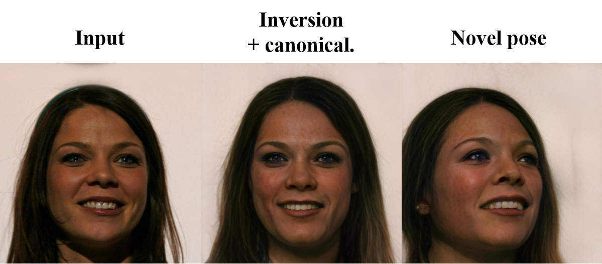

## Injecting 3D Perception of Controllable NeRF-GAN into StyleGAN for Editable Portrait Image Synthesis


### [Project page](https://jgkwak95.github.io/surfgan/) | [Paper]()  

###  "Injecting 3D Perception of Controllable NeRF-GAN into StyleGAN for Editable Portrait Image Synthesis"<br>
[Jeong-gi Kwak](https://jgkwak95.github.io/), Yuanming Li, Dongsik Yoon, Donghyeon Kim, David Han, Hanseok Ko <br>
*European Conference on Computer Vision (ECCV), 2022*
<br>


This repository includes the official Pytorch implementation of SURF-GAN


## SURF-GAN 

https://user-images.githubusercontent.com/67986601/180271569-b8d3ff6d-6d33-4181-8997-a41b0163badc.mp4 

Camera control + Semantic attribute editing (trained on 64x64 CelebA and rendered at 256x256) <br>
<br>
SURF-GAN can discover and control semantic attributes in an unsupervised manner. <br>

<!-- ### Envs -->
<!-- ### Training -->
<!-- ### Evaluation -->
<!-- ### Generation  -->
<!-- ### Semantic attributes discovery -->

### Get started
Instructions will be updated. <br>

## 3D-Controllable StyleGAN

Injecting the 3D prior of SURF-GAN into StyleGAN.


 <br>

### Video
 <br>
 <br>
 <br>

### + Style
It is comatible with numerous StyleGAN-based techniques, e.g., [Toonifying](https://github.com/justinpinkney/toonify). <br>
 <br>
 <br>

### Notice

We apologize that the code for 3D-controllable will not be released. <br>
But the code for the frontalization part will be uploaded to [here](https://github.com/jgkwak95/Character-frontalization).


### Limitation 
Our 3D controllable StyleGAN is not based on 3D representations such as mesh or NeRF, so as you can see when it comes to video generation, it shows the problem of “texture sticking” pointed out in [StyleGAN3](https://nvlabs.github.io/stylegan3/) (especially in hair and beard). That is one of the most noticable artifacts in GAN generated videos. We expect this to be mitigated with StyleGAN3. <br>
 <br>
 <br>


## Citation 


```
@article{kwak2022injecting,
  author    = {Kwak, Jeong-gi and Li, Yuanming and Yoon, Dongsik and Kim, Donghyeon and Han, David and Ko, Hanseok},
  title     = {Injecting 3D Perception of Controllable NeRF-GAN into StyleGAN for Editable Portrait Image Synthesis},
  journal   = {arXiv},
  year      = {2022},
}
```

## Acknowledgments

-  SURF-GAN is bulided upon the [pi-GAN](https://github.com/marcoamonteiro/pi-GAN) implementation and inspired by [EigenGAN](https://github.com/LynnHo/EigenGAN-Tensorflow).  
-  We used [pSp encoder](https://github.com/eladrich/pixel2style2pixel) ([e4e](https://github.com/omertov/encoder4editing) also works) and [StyleGAN2-pytorch](https://github.com/rosinality/stylegan2-pytorch) to build 3D-controllable StyleGAN.  

Thanks for their wonderful works!

